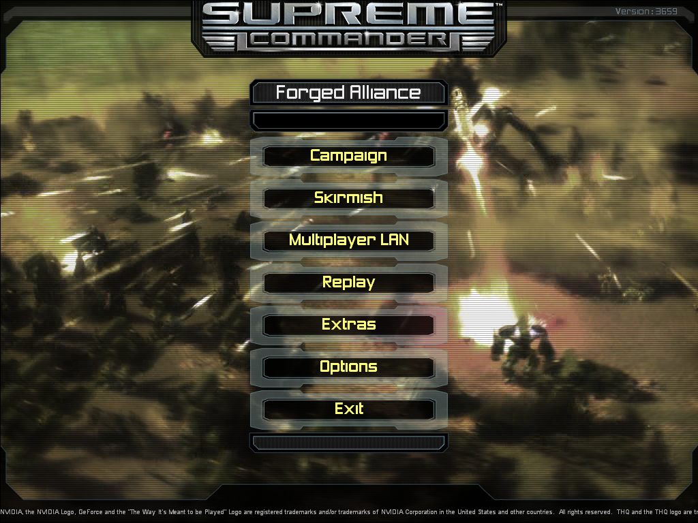

===================
scfa-mod-scmainmenu
===================

About
=====

``scmainmenu`` is a **Supreme Commander: Forged Alliance** Mod to bring back
most of the vanilla SC Menu Look and Music to FA (and FAF); with some slight
differences to the original.

Essentially it is a merge of both Menus, codewise, and takes into account
some changes made in FA.

Aside from that, none of the Menu UI is changed (confirmation dialogs,
popup boxes and game lobbies), these continue to have the FA look.

For "vanilla" FA, the defunkt *GPGNet* Menu entry is removed, essentially
mirroring the FAF client changes.

This mod is not a *Sim mod* and neither really a *UI mod*.
It does not change any Sim behavior or gameplay.
It also does not modify any ingame UI elements (after a game has started).

Downloading
===========

Download the packaged version as ``scmainmenu.scd`` from
https://github.com/nyov/scfa-mod-scmainmenu/releases/latest .

Do not download from the "zipball/master" GH url or the source code zipfile,
as these include a top level directory and will not work without manual
repackaging.

Installation
============

This mod cannot use the Game-inbuilt mod functionality (which only works
for ingame mods). The Main menu has long been created and displayed before the
game starts loading any ingame mods.
For this reason no ``mod_info.lua`` is bundled with the mod in the first place.

Instead this mod shadows the original game files and needs to be installed
into the games ``gamedata``-folder:

For vanilla FA
--------------

Simply drop the downloaded or source-built ``scmainmenu.scd`` in your FA
installation inside the ``gamedata`` folder.
The full path should normally be something like
``C:\Program Files\THQ\Gas Powered Games\Supreme Commander - Forged Alliance\gamedata\``.

(For Linux it may be
``~/.local/share/wineprefixes/original/drive_c/Program Files/THQ/Gas Powered Games/Supreme Commander - Forged Alliance/gamedata/``.)

Start the game normally and the mod should be active.
To uninstall or deactivate, simply remove the file again.

For Steam FA
------------

**This currently does not work, since the Menu does not know about the
"Matchmaking" menu entry.**
Adding it will be considered for a later version.

Simply drop the downloaded or source-built ``scmainmenu.scd`` in your Steam FA
installation inside the ``gamedata`` folder.

The full path for the steam installation should be something like
``C:\Program Files\Steam\steamapps\common\Supreme Commander Forged Alliance\gamedata\``.

(For Linux it may be
``~/.local/share/wineprefixes/original/drive_c/Program\ Files/Steam/steamapps/common/Supreme\ Commander\ Forged\ Alliance/gamedata/``.)

For FAF
-------

This one is the most complicated, since FAF defaults to **blacklisting all the
things**.

**Option 1**: Rename the file to something whitelisted by the FAF startup file
(``init_faf.lua``).

In the FA-installation's ``gamedata`` folder the filenames
``lobbymanager_v105.scd`` or ``sc_music.scd`` would work. Unless you happen to
have both these mods installed already.
Then fall back to ``loc_fr.scd``, ``loc_it.scd``, ``loc_ru.scd`` for example;
some localization language file you don't happen to have.

(The hard part may be remembering that the mod is hidden in that filename.)

**Option 2**: Install the mod for the FAF client only, by dropping the file
into the *FAForever* directory.

*The mod will not be active when the game is started from a vanilla FA shortcut,
unless you also drop it there, as detailed above for vanilla FA.*

This should be located somewhere like
``C:\windows\profiles\All Users\FAForever\gamedata\``.

To be recognized there, the fileending must be ``.nxt`` or ``.nx2``.
Renaming the file to ``scmainmenu.nx2`` should work.

**Option 3**: Create a custom ``init_fax.lua`` startup file.

*The mod will not be active when joining or hosting a game through the FAF
Lobby client, but in that case you don't get to see the main menu anyway.
When FAF is started from the new shortcut for a local game, it will be active.*

Copy ``C:\windows\profiles\All Users\FAForever\bin\init_faf.lua`` to
``init_fax.lua``, in the same directory.

Create a game shortcut on your Desktop to
``[...]\FAForever\bin\ForgedAlliance.exe``, and change the commandline to read
``[...]ForgedAlliance.exe /init init_fax.lua /nobugreport``.

Finally load up the ``init_fax.lua`` file in a text editor and add a line
``scmainmenu.scd`` into the ``whitelist = {}`` section.

(Don't try simply editing the ``init_faf.lua`` file. It will
be overwritten each time the game is started from the FAF Lobby...)

**Option 4**: *Unzip* the ``scmainmenu.scd`` and just drop the contents
(including the full folder paths) into your FA installation directory.
(**Outside** the ``gamedata`` folder in this case.)

Make sure none of the files exist already so nothing gets overwritten, however
that should always be the case for a normal, unmodded installation.
